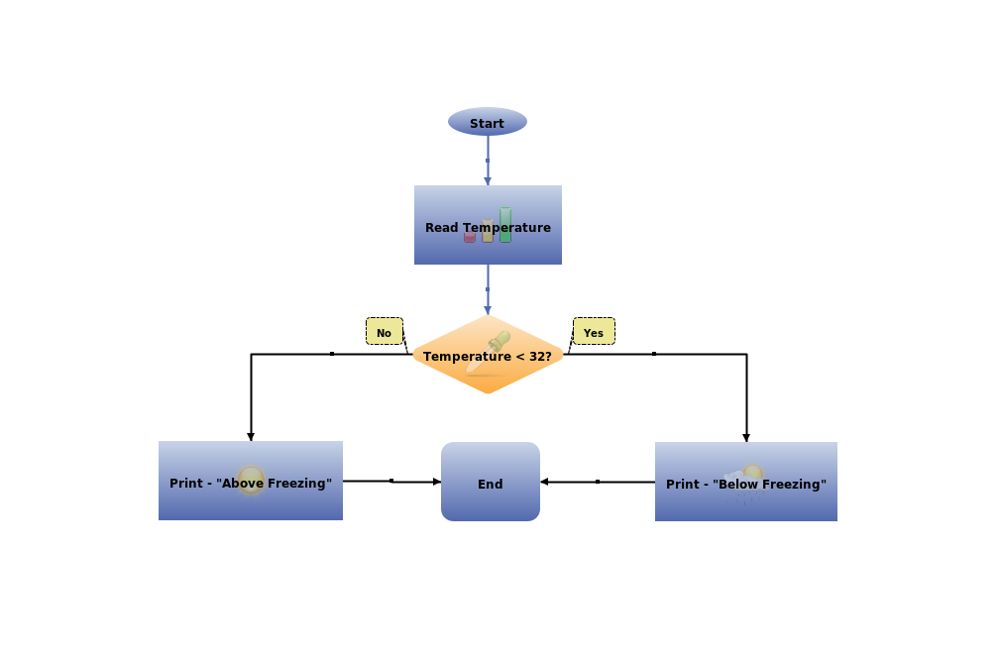

# SMYLD Entity Plot
The SMYLD entity plot project is a swing component that plots the entity diagrams, connects them together and they can interactively being updated and changed, one of the use cases is the flow chart. Soon will activate an open source UML project that is based on this library. 

The diagram can be updated by the user on runtime, full animation of the object, maintaining the connections between them and update their contents as well.

#### Sample
The below XML will define the elements of a simple flow chart, feeding this file into the Flow chart component:


```xml
<flowchart>
    <images>apps/ep/EntityPlot/src/test/resources/images/</images>
    <elements>
        <element id="start" type="Start1"   x="80" y="100" width="80" height="20" connTo="false" connFrom="true">Start</element>
        <element id="readTemp" type="Process" x="80" y="100" width="100" height="80" connTo="true" connFrom="true" reflect="true" shadow="true" bgImage="chart_48.png">Read Temperature</element>
        <element id="tempCheck" type="Decision" x="80" y="100" width="100" height="80" connTo="true" connFrom="true" reflect="true" shadow="true" bgImage="check_48.png">Temperature &lt; 32?</element>
        <element id="printAboveTemp" type="Process" x="80" y="100" width="100" height="80" connTo="true" connFrom="true" reflect="true" shadow="true" bgImage="sun_48.png">Print - "Above Freezing"</element>
        <element id="printBelowTemp" type="Process" x="80" y="100" width="100" height="80" connTo="true" connFrom="true" reflect="true" shadow="true" bgImage="cold_48.png">Print - "Below Freezing"</element>
        <element id="end" type="Terminator" x="80" y="100" width="100" height="80" connTo="true" connFrom="true" reflect="true" shadow="true">End</element>

    </elements>
    <connections>
        <connection from="start"           to="readTemp" />
        <connection from="readTemp"        to="tempCheck" />
        <connection from="tempCheck"       to="printAboveTemp" color="BLACK">No</connection>
        <connection from="tempCheck"       to="printBelowTemp" color="BLACK">Yes</connection>
        <connection from="printBelowTemp"  to="end" color="BLACK" />
        <connection from="printAboveTemp"  to="end" color="BLACK" />
    </connections>
</flowchart>

```

Will result in the chart below:


As can be seen from the XML, there are several attributes which will affect the appearance of the chart, like if we drop the shadow attribute, we will end up with the chart like the one below:


Also if we drop the reflection, we will have the following:



Also by ommitting the pictures, we will have a simpler chart as the one below:


Also you might notice that the pictures are not similar to each other from the positioning of the elements perspective. That is due to the fact that the chart was manually arranged each time. To see how this chart looks like at runtime, see the video below:


_**PE Simple Flow Chart Diagram in Action to follow**_


_**Documentation to follow**_
