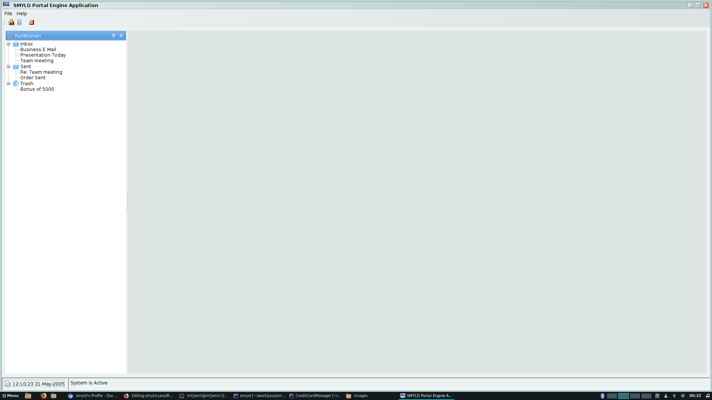
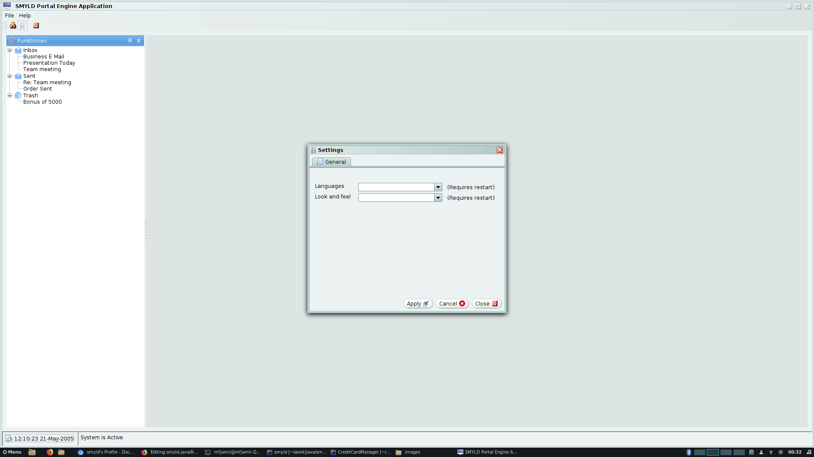
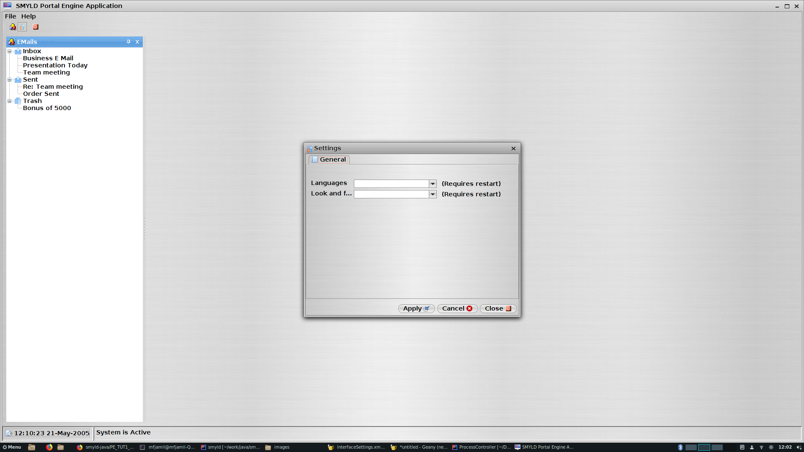
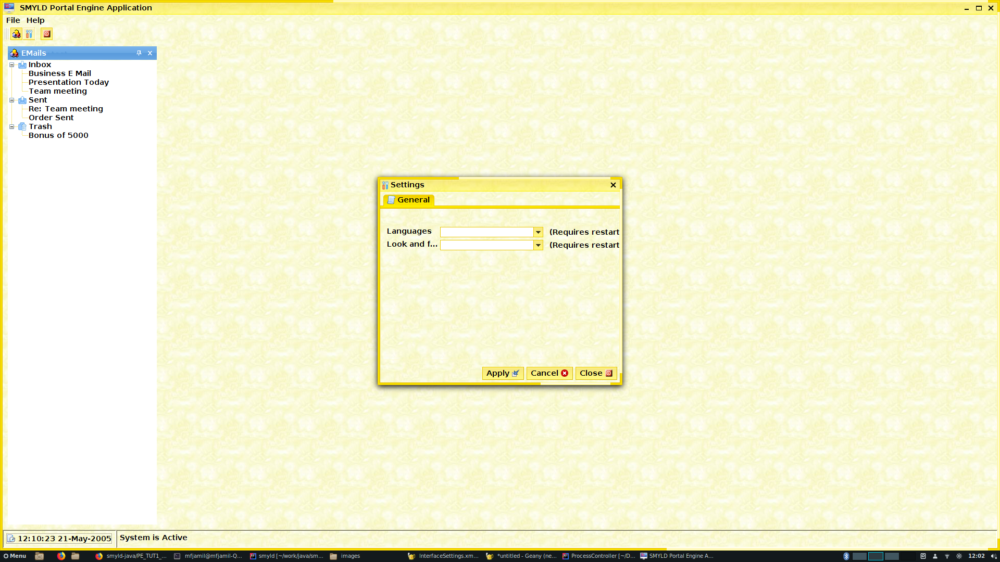
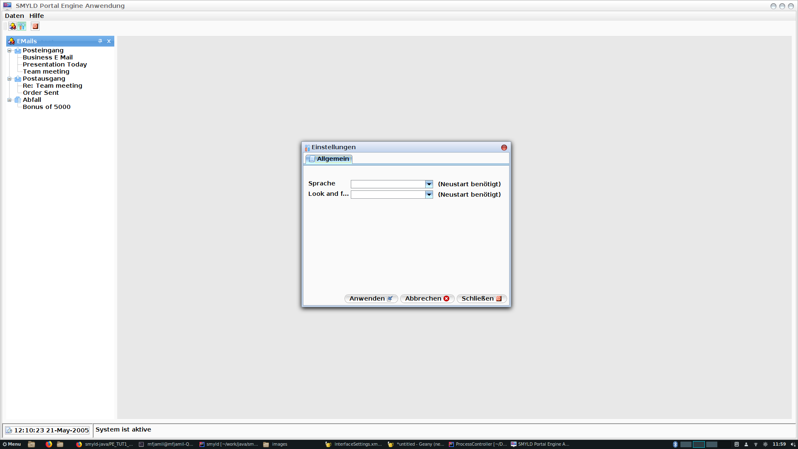

[](https://mvnrepository.com/artifact/org.smyld.app.pe/smyld-app-portalengine/1.0.8)

[](https://github.com/MFjamil/smyld-java/blob/master/LICENSE)

# Current Portal Engine Features
   The current available version of Portal Engine includes the following features:
   * Dynamic Creation of Swing components.
   * GUI interface defined in XML file.
   * Multi-Lingual interface.
   * User Based roles can be injected to show different interfaces.
   * Dependency Injection via Annotations for interaction between the Business and the GUI Layer.
   * Smooth startup via maven.

## Using Portal Engine
   The current version of Portal Engine can be used to generate Swing Applications and the GUI source format currently being supported is only XML. Recently, the Engine was partially updated to adop to the technology changes. Spring Boot in its simplicity was inspiring us to follow a similar approach. With a relatively small POM file, the engine will be ready to pick up the defined XML file by the developer and to generate the required components.
   **The current Portal Engine is already available on Maven Central Repository!**, below are some tutorials that can give a quick start:
 
### Using Maven Archetype

#### Visual Tutorial
 
[ >>>> Part 1 <<<< ](https://www.youtube.com/watch?v=cLuz07c0kiU)

_More parts to follow_

#### Documented Tutorial

   Via issuing the command below, you can generate a complete maven project that holds a startup swing based maven project.
   ```shell
   mvn archetype:generate -DgroupId=[Your Group ID] -DartifactId=[Your Artifact ID] -DarchetypeGroupId=org.smyld.app.pe -DarchetypeArtifactId=PESample-archetype -DarchetypeVersion=1.0.8 -DinteractiveMode=false 
   ```
  The Group ID is usually the package name of your project, the Artifact ID will be the project name. Let us suppose that you will need a project to control some process, let us name it "ProcessController" and your package will be "com.mycompany.apps". You can issue it as follows:
   ```shell
   mvn archetype:generate -DgroupId=com.mycompany.apps -DartifactId=ProcessController -DarchetypeGroupId=org.smyld.app.pe -DarchetypeArtifactId=PESample-archetype -DarchetypeVersion=1.0.8 -DinteractiveMode=false 
   ```
   Issuing the command will result in creating the project, see below:
   ```mvn
   mvn archetype:generate -DgroupId=com.mycompany.apps -DartifactId=ProcessController -DarchetypeGroupId=org.smyld.app.pe -DarchetypeArtifactId=PESample-archetype -DinteractiveMode=false 
[INFO] Scanning for projects...
[INFO] 
[INFO] ------------------< org.apache.maven:standalone-pom >-------------------
[INFO] Building Maven Stub Project (No POM) 1
[INFO] --------------------------------[ pom ]---------------------------------
[INFO] 
[INFO] >>> maven-archetype-plugin:3.0.1:generate (default-cli) > generate-sources @ standalone-pom >>>
[INFO] 
[INFO] <<< maven-archetype-plugin:3.0.1:generate (default-cli) < generate-sources @ standalone-pom <<<
[INFO] 
[INFO] 
[INFO] --- maven-archetype-plugin:3.0.1:generate (default-cli) @ standalone-pom ---
[INFO] Generating project in Batch mode
[INFO] Archetype [org.smyld.app.pe:PESample-archetype:1.0.6] found in catalog local
[INFO] ----------------------------------------------------------------------------
[INFO] Using following parameters for creating project from Archetype: PESample-archetype:1.0.6
[INFO] ----------------------------------------------------------------------------
[INFO] Parameter: groupId, Value: com.mycompany.apps
[INFO] Parameter: artifactId, Value: ProcessController
[INFO] Parameter: version, Value: 1.0-SNAPSHOT
[INFO] Parameter: package, Value: com.mycompany.apps
[INFO] Parameter: packageInPathFormat, Value: com/mycompany/apps
[INFO] Parameter: version, Value: 1.0-SNAPSHOT
[INFO] Parameter: package, Value: com.mycompany.apps
[INFO] Parameter: groupId, Value: com.mycompany.apps
[INFO] Parameter: artifactId, Value: ProcessController
[INFO] Project created from Archetype in dir: /home/mfjamil/Documents/temp/PE_test/ProcessController
[INFO] ------------------------------------------------------------------------
[INFO] BUILD SUCCESS
[INFO] ------------------------------------------------------------------------
[INFO] Total time:  11.827 s
[INFO] Finished at: 2019-09-28T00:04:28+02:00
[INFO] ------------------------------------------------------------------------
```
 The generated project Tree will look like below:
 ```shell
 ProcessController$ tree
.
├── InterfaceSettings.xml
├── pom.xml
└── src
    ├── main
    │   ├── java
    │   │   └── com
    │   │       └── mycompany
    │   │           └── apps
    │   └── resources
    │       ├── Application_gui.xml
    │       ├── images
    │       │   ├── close_16.png
    │       │   ├── functions.png
    │       │   ├── help.png
    │       │   ├── inbox.png
    │       │   ├── monitor_16.png
    │       │   ├── monitor.png
    │       │   ├── object.gif
    │       │   ├── process-stop.png
    │       │   ├── schedule.png
    │       │   ├── script.png
    │       │   ├── sent.png
    │       │   ├── settings_16.png
    │       │   ├── trash.png
    │       │   └── view-restore.png
    │       └── lang
    │           ├── English.xml
    │           └── German.xml
    └── test
        └── java

11 directories, 20 files
```
   Besides the pom file, a startup resources that includes the XML file as well as the images and language files will be generated.
   The generated pom file is shown below:
```xml
<?xml version="1.0" encoding="UTF-8"?>
<project>
	<modelVersion>4.0.0</modelVersion>
	<parent>
		<groupId>org.smyld.app.pe</groupId>
		<artifactId>pe-boot-dependencies</artifactId>
		<version>1.0.6</version> 
	</parent>
	<groupId>com.mycompany.apps</groupId>
	<artifactId>ProcessController</artifactId>
	<packaging>jar</packaging>
	<version>1.0-SNAPSHOT</version>
	<name>Portal Engine Sample</name>
	<description>Portal Engine Sample</description>
	<build>
	<plugins>
		<plugin>
			<groupId>org.smyld.app.pe</groupId>
			<artifactId>smyld-pe-maven-plugin</artifactId>
		</plugin>
		<plugin><artifactId>maven-assembly-plugin</artifactId></plugin>
	</plugins>
	</build>
</project>

```
Now by issuing the maven command to install the application:
```shell
mvn clean install
```
The Portal Engine artifacts will be downloaded and the Plugin will start building the swing components. The assembly plugin will generate a complete Executable jar file called "executable.jar" that can be found under "target" folder.
Running the java command to start it up will make you see the generated template:
``` shell
java -jar target/executable.jar
```
We will see the MDI window generated:


By clicking on the Functions menu, you will see a dockable panel, as can be seen below:



Wait a minute, Dockable?! there is no standard dockable component in Swing. Yes you are right, this is one of the components that were developed within smyld-gui project (back in 2004) and is integrated into the Portal Engine.

The template that will be generated via this Archetype also contains a simple settings window. See below:



**Changing the application settings**

There are two files created on both the main path and under target path, holding the name "InterfaceSettings.xml". In order to allow for smooth startup, the file was copied in those two locations, so that once the command for running the executable file invoked, it will manage to find the settings file with the default name. For sure this can be changed via the execution command parameters (more on that will be explained later).
The settings file contents are shown below:

```xml
<?xml version="1.0" encoding="UTF-8"?>
<applicationSettings>
  <group>com.mycompany.apps</group>
  <log>
    <name />
    <path />
  </log>
  <languages default="English">
    <language name="English" src="English.xml" />
    <language name="German" src="German.xml" />
  </languages>
  <lookandfeels default="Goodies Plastic 3D">
    <lookandfeel name="Goodies Plastic 3D" class="com.jgoodies.looks.plastic.Plastic3DLookAndFeel" />
    <lookandfeel name="Jtattoo Smart" class="com.jtattoo.plaf.smart.SmartLookAndFeel" />
    <lookandfeel name="Goodies Plastic XP" class="com.jgoodies.looks.plastic.PlasticXPLookAndFeel" />
    <lookandfeel name="Jtattoo HiFi" class="com.jtattoo.plaf.hifi.HiFiLookAndFeel" />
    <lookandfeel name="Jtattoo McWin" class="com.jtattoo.plaf.mcwin.McWinLookAndFeel" />
    <lookandfeel name="Jtattoo Aero" class="com.jtattoo.plaf.aero.AeroLookAndFeel" />
    <lookandfeel name="Jtattoo Noire" class="com.jtattoo.plaf.noire.NoireLookAndFeel" />
    <lookandfeel name="Jtattoo Bernstein" class="com.jtattoo.plaf.bernstein.BernsteinLookAndFeel" />
    <lookandfeel name="Jtattoo Mint" class="com.jtattoo.plaf.mint.MintLookAndFeel" />
    <lookandfeel name="Jtattoo Aluminium" class="com.jtattoo.plaf.aluminium.AluminiumLookAndFeel" />
    <lookandfeel name="Jtattoo Luna" class="com.jtattoo.plaf.luna.LunaLookAndFeel" />
    <lookandfeel name="Jtattoo Acryl" class="com.jtattoo.plaf.acryl.AcrylLookAndFeel" />
    <lookandfeel name="Jtattoo Fast" class="com.jtattoo.plaf.fast.FastLookAndFeel" />
  </lookandfeels>
</applicationSettings>

```
 The main sections are explained as below:
 
 **group**
 
 As you can see that the group generated is the same one provided upon creating the project (the package name), this tag is important for the portal engine for DI (Dependency Injection) processing, so that it can pick up your annotated code (more on that will be explained later).
 
 **log**

  Will hold the path and file name that will hold the logging messages.
  
  **languages**
  
  In this section, you can extend it to hold any language and by updating the detault attribute, the language of the interface will be changed. For sure this kind of change requires a restart.
  
  **lookandfeels**
  
  Similar to how the languages section works, the list of available look and feels shows the different options and by updating the default, they can be changed.
  

Below are some of the different Look and Feels as well as different language setup:










**Ok nice, now how can I use it?!**

Before we learn how to use the Portal Engine, we need to know how it works first.

_ToDo: Link on the basic usage of portal engine_

Portal engine supports two ways of interaction between the GUI and the Business layers.

   **Old APIs - Interfaces**
   
      Upon invoking the Portal Engine and based on the configuration, the Engine will create Interfaces and will handle the GUI events and interactions based on the implementation of these interfaces. Although that creating these interfaces belongs to the old version of the Portal Engine, they are currently still active. The only draw back of this approach is that the developer will need to provide implementations for all the interfaces even if they are not fully required.
   
   _ToDo: Link on a tutorial for using the interfaces to follow_
   
   **New APIs - Annotations**   
   
   The new APIs will process the annotations written by the developer. Based on any action or event in the configuration file, the engine will check if there is annotation for that particular action and will invoke it. The developer can in this case only writes the actions of his choice. 
   
   _ToDo: Link on a tutorial for using the interfaces to follow_


_More detailed description with tutorials on using the engine will follow_


[<< Back to Main Page](.)
