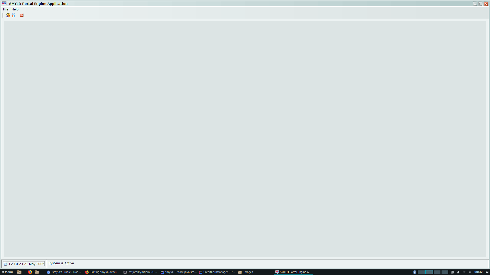
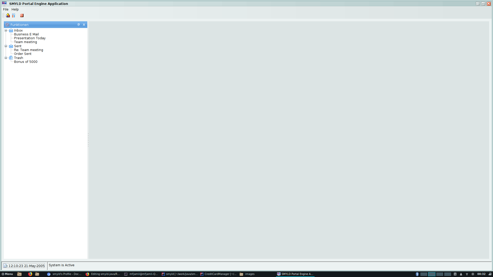
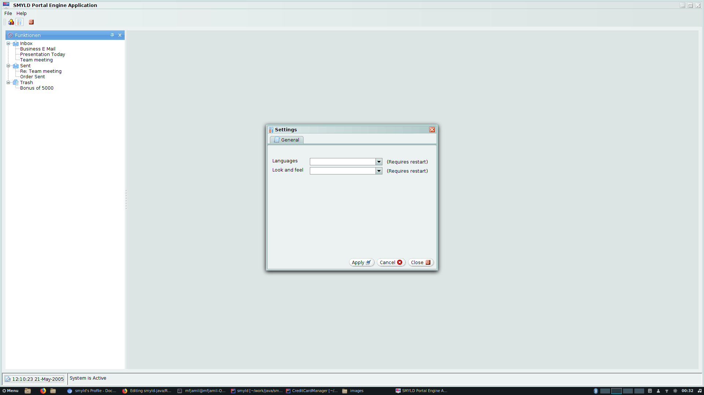

# SMYLD Portal Engine
Portal Engine is establishing a compelete segregation between GUI layer and other modules of the software, the target is to eleminate the boilerplate code and to alleviates dealing with GUI components. The framework was originally designed to deal with Swing Components back in 2004, was successfully used with many applications which saved considerable time.

### Swing! are you serious? in 2019!
Well you are right, many alternatives are available but do not forget some facts:

#### 1 - Multi-threading 
#### 2 - Performance
#### 3 - Intellij

**Intellij !** ... YES! one of the most powerful editors in the market is still written with Swing. However Jet Brains holds also a powerful development team. Still, it is written in Swing.

**What about Java FX!** Well, till now, the performance is still on the side of Swing.


**However this is not only about Swing!** 


## Portal Engine Concept
   The Portal Engine concept is to deal with the GUI layer as a separate module that will interact with the rest of the modules via defined interfaces. The GUI definition can take different formats: 
   * **XML file**   
   * **YAML file**
   * **JSON file**
   * **Data Base**

The Portal Engine will handle reading the file and generating the required components. The Components can belong to any technology/framework. We can define the components in two types:

#### 1 - Desktop:
   Desktop based widgets can be any of the following:
   * **JDK/Swing**
   * **JDK/SWT**
   * **Node.js/Electron**
   * **Node.js/NW.js**
  
  And many more..

#### 2 - Web.
   Web based frameworks are available and involve some complexity that can be eliminated by the Portal Engine as well, although that the component oriented approach might look like a limitation for the creativity of the developer when working with such an approach, but saving a lot of time might be needed in some projects, some of the well known frameworks can be:
   * **Angular**
   * **React**
   * **Vue**

   And many more ..

## Building Process
   Building tools are rich and the Portal Engine can be extended to use most of them. Currently the available building ways are:
   * **Stand Alone Application**
   * **Maven Plugin**
   * **Spring Boot Application**
   
   However, it can also be developed to use Gradle, Jenkins, Docker ...etc.

## Developing Portal Engine
   Sure we will be so happy if other developers will love to participate in this project and extend it to fullfill the concept mentioned above. The more collaborating developers with ultimate diligence to foster the Engine, the more prominence it will be. Any provision of a help will be highly appreciated.  

## Current Portal Engine Features
   The current available version of Portal Engine includes the following features:
   * Dynamic Creation of Swing components.
   * GUI interface defined in XML file.
   * Multi-Lingual interface.
   * User Based roles can be injected to show different interfaces.
   * Dependency Injection via Annotations for interaction between the Business and the GUI Layer.
   * Smooth startup via maven.

## Using Portal Engine
   The current version of Portal Engine can be used to generate Swing Applications and the GUI source format currently being supported is only XML. Recently, the Engine was partially updated to adop to the technology changes. Spring Boot in its simplicity was inspiring us to follow a similar approach. With a relatively small POM file, the engine will be ready to pick up the defined XML file by the developer and to generate the required components.
   **The current Portal Engine is already available on Maven Central Repository!**, below are some tutorials that can give a quick start:
 
### Using Maven Archetype
   Via issuing the command below, you can generate a complete maven project that holds a startup swing based maven project.
   ```shell
   mvn archetype:generate -DgroupId=[Your Group ID] -DartifactId=[Your Artifact ID] -DarchetypeGroupId=org.smyld.app.pe -DarchetypeArtifactId=PESample-archetype -DinteractiveMode=false 
   ```
   The Group ID is usually the package name of your project, the Artifact ID will be the project name. Let us suppose that you will need a project to control some process, let us name it "ProcessController" and your package will be "com.mycompany.apps". You can issue it as follows:
   ```shell
   mvn archetype:generate -DgroupId=com.mycompany.apps -DartifactId=ProcessController -DarchetypeGroupId=org.smyld.app.pe -DarchetypeArtifactId=PESample-archetype -DinteractiveMode=false 
   ```
   Issuing the command will result in creating the project, see below:
   ```mvn
   mvn archetype:generate -DgroupId=com.mycompany.apps -DartifactId=ProcessController -DarchetypeGroupId=org.smyld.app.pe -DarchetypeArtifactId=PESample-archetype -DinteractiveMode=false 
[INFO] Scanning for projects...
[INFO] 
[INFO] ------------------< org.apache.maven:standalone-pom >-------------------
[INFO] Building Maven Stub Project (No POM) 1
[INFO] --------------------------------[ pom ]---------------------------------
[INFO] 
[INFO] >>> maven-archetype-plugin:3.0.1:generate (default-cli) > generate-sources @ standalone-pom >>>
[INFO] 
[INFO] <<< maven-archetype-plugin:3.0.1:generate (default-cli) < generate-sources @ standalone-pom <<<
[INFO] 
[INFO] 
[INFO] --- maven-archetype-plugin:3.0.1:generate (default-cli) @ standalone-pom ---
[INFO] Generating project in Batch mode
[INFO] Archetype [org.smyld.app.pe:PESample-archetype:1.0.6] found in catalog local
[INFO] ----------------------------------------------------------------------------
[INFO] Using following parameters for creating project from Archetype: PESample-archetype:1.0.6
[INFO] ----------------------------------------------------------------------------
[INFO] Parameter: groupId, Value: com.mycompany.apps
[INFO] Parameter: artifactId, Value: ProcessController
[INFO] Parameter: version, Value: 1.0-SNAPSHOT
[INFO] Parameter: package, Value: com.mycompany.apps
[INFO] Parameter: packageInPathFormat, Value: com/mycompany/apps
[INFO] Parameter: version, Value: 1.0-SNAPSHOT
[INFO] Parameter: package, Value: com.mycompany.apps
[INFO] Parameter: groupId, Value: com.mycompany.apps
[INFO] Parameter: artifactId, Value: ProcessController
[INFO] Project created from Archetype in dir: /home/mfjamil/Documents/temp/PE_test/ProcessController
[INFO] ------------------------------------------------------------------------
[INFO] BUILD SUCCESS
[INFO] ------------------------------------------------------------------------
[INFO] Total time:  11.827 s
[INFO] Finished at: 2019-09-28T00:04:28+02:00
[INFO] ------------------------------------------------------------------------
```
 The generated project Tree will look like below:
 ```shell
 ProcessController$ tree
.
├── InterfaceSettings.xml
├── pom.xml
└── src
    ├── main
    │   ├── java
    │   │   └── com
    │   │       └── mycompany
    │   │           └── apps
    │   └── resources
    │       ├── Application_gui.xml
    │       ├── images
    │       │   ├── close_16.png
    │       │   ├── functions.png
    │       │   ├── help.png
    │       │   ├── inbox.png
    │       │   ├── monitor_16.png
    │       │   ├── monitor.png
    │       │   ├── object.gif
    │       │   ├── process-stop.png
    │       │   ├── schedule.png
    │       │   ├── script.png
    │       │   ├── sent.png
    │       │   ├── settings_16.png
    │       │   ├── trash.png
    │       │   └── view-restore.png
    │       └── lang
    │           ├── English.xml
    │           └── German.xml
    └── test
        └── java

11 directories, 20 files
```
   Besides the pom file, a startup resources that includes the XML file as well as the images and language files will be generated.
   The generated pom file is shown below:
```xml
<?xml version="1.0" encoding="UTF-8"?>
<project>
	<modelVersion>4.0.0</modelVersion>
	<parent>
		<groupId>org.smyld.app.pe</groupId>
		<artifactId>pe-boot-dependencies</artifactId>
		<version>1.0.6</version> 
	</parent>
	<groupId>com.mycompany.apps</groupId>
	<artifactId>ProcessController</artifactId>
	<packaging>jar</packaging>
	<version>1.0-SNAPSHOT</version>
	<name>Portal Engine Sample</name>
	<description>Portal Engine Sample</description>
	<build>
	<plugins>
		<plugin>
			<groupId>org.smyld.app.pe</groupId>
			<artifactId>smyld-pe-maven-plugin</artifactId>
		</plugin>
		<plugin><artifactId>maven-assembly-plugin</artifactId></plugin>
	</plugins>
	</build>
</project>

```
Now by issuing the maven command to install the application:
```shell
mvn clean install
```
The Portal Engine artifacts will be downloaded and the Plugin will start building the swing components. The assembly plugin will generate a complete Executable jar file called "executable.jar" that can be found under "target" folder.
Running the java command to start it up will make you see the generated template:
``` shell
java -jar target/executable.jar
```
We will see the MDI window generated:



By clicking on the Functions menu, you will see a dockable panel, as can be seen below:



Wait a minute, Dockable?! there is no standard dockable component in Swing. Yes you are right, this is one of the components that were developed within smyld-gui project (back in 2004) and is integrated into the Portal Engine.

The template that will be generated via this Archetype also contains a simple settings window. See below:


   
   
**Ok nice, now how can I use it?!**

As a developer, you need to interact with the interface and write your code. First of all, you need to understand 
   
   
_More detailed description with tutorials on using the engine will follow_

